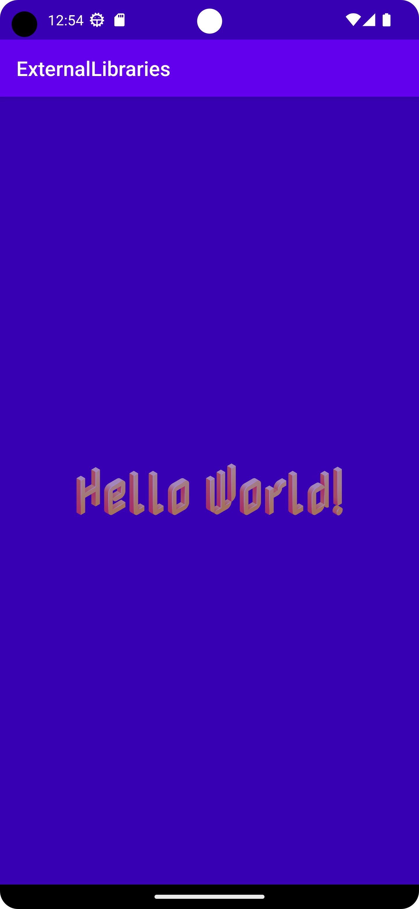

# Rapport

**Hämtade Calligraphy biblioteket från github, biblioteket gör det möljigt att använda sig av "custom fonts". 
Implementerade den i build.gradle, därefter initieras ViewPump i MainActivity där skapade man en attribut
fontPath som gör att man kan ändra font på text-element.**


# Kodsegment 1
```
    // Build.gradle
    implementation 'io.github.inflationx:calligraphy3:3.1.1'
    implementation 'io.github.inflationx:viewpump:2.0.3'
    
    //MainActivity class
            ViewPump.init(ViewPump.builder()
                .addInterceptor(new CalligraphyInterceptor(
                        new CalligraphyConfig.Builder()
                                //.setDefaultFontPath("fonts/Nabla-Regular-VariableFont.ttf")
                                .setFontAttrId(R.attr.fontPath)
                                .build()))
                .build());
```

